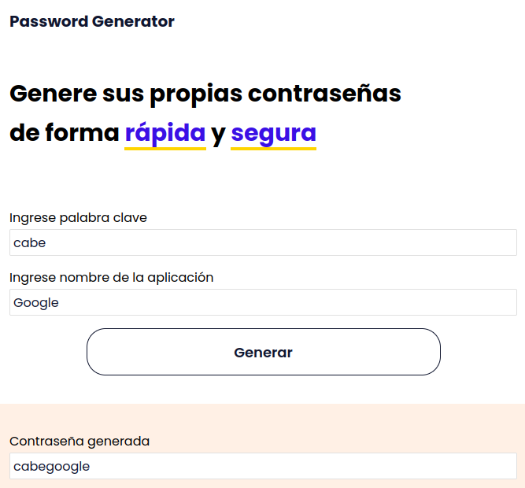

# Password Generator



> Screenshot - Página principal o Home

---

## Tabla de contenidos

- [Descripción](#descripción)
- [¿Cómo usar esta aplicación?](#cómo-usar-esta-aplicación)
- [Referencias](#referencias)
- [Licencia](#licencia)
- [Autor](#autor)

---

## Descripción

Generador de contraseñas personal hecho en ReactJS.

### Tecnologías

- HTML
- CSS
- Javascript
- React
- Styled components

[Ir al inicio](#password-generator)

---

## ¿Cómo usar esta aplicación?

Primero, clona el repositorio usando tu llave pública ssh en la carpeta local de tu preferencia, usando el siguiente comando:

```html
$ git clone git@github.com:heraldofortuna/password-generator.git
```

Ahora, ingresa al directorio de la aplicación:

```html
$ cd password-generator
```

Luego, instala las dependencias de la aplicación corriendo el siguiente comando npm:

```html
npm install
```

Una vez cargado todo, ya estamos listos para arrancar la aplicación ingresando lo siguiente:

```html
npm start
```

Finalmente, abrimos el link de nuestro localhost [http://localhost:3000](http://localhost:3000) para ver nuestro desarrollo en un ambiente seguro.

- Ojo: La aplicación ya se encuentra deployada en la web en el siguiente enlace gh:

```html
https://heraldofortuna.github.io/password-generator/
```

---

## Referencias

Documentación oficial de React

```html
https://reactjs.org/docs/getting-started.html
```

Documentación de Styled Components

```html
https://styled-components.com/docs
```

[Ir al inicio](#password-generator)

---

## Comentarios

- Esta aplicación está pensadad para ser un SPA por lo que aún no se implementa rutas.

- La aplicación es responsiva al 100% (usé medias queries para esto).

[Ir al inicio](#password-generator)

---

## Licencia

MIT License

Copyright (c) [2021] [Heraldo Fortuna]

Permission is hereby granted, free of charge, to any person obtaining a copy
of this software and associated documentation files (the "Software"), to deal
in the Software without restriction, including without limitation the rights
to use, copy, modify, merge, publish, distribute, sublicense, and/or sell
copies of the Software, and to permit persons to whom the Software is
furnished to do so, subject to the following conditions:

The above copyright notice and this permission notice shall be included in all
copies or substantial portions of the Software.

THE SOFTWARE IS PROVIDED "AS IS", WITHOUT WARRANTY OF ANY KIND, EXPRESS OR
IMPLIED, INCLUDING BUT NOT LIMITED TO THE WARRANTIES OF MERCHANTABILITY,
FITNESS FOR A PARTICULAR PURPOSE AND NONINFRINGEMENT. IN NO EVENT SHALL THE
AUTHORS OR COPYRIGHT HOLDERS BE LIABLE FOR ANY CLAIM, DAMAGES OR OTHER
LIABILITY, WHETHER IN AN ACTION OF CONTRACT, TORT OR OTHERWISE, ARISING FROM,
OUT OF OR IN CONNECTION WITH THE SOFTWARE OR THE USE OR OTHER DEALINGS IN THE
SOFTWARE.

[Ir al inicio](#password-generator)

---

## Autor

- Twitter - [@heraldofortuna](https://twitter.com/heraldofortuna)
- GitHub - [heraldofortuna](https://github.com/heraldofortuna)
- Linkedin - [heraldofortuna](https://www.linkedin.com/in/heraldo-fortuna/)

[Ir al inicio](#password-generator)
